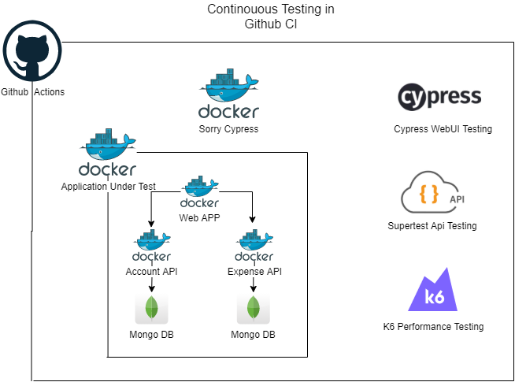

# End To End Testing Framework

## Testing Framework Architecture

### Project Setup:

- git clone repo
- npm install

### Write Code:

- Add `/// <reference types="Cypress" />` on the top, to get typed reference.
- Add new spec file with the format sampleTest\*\_spec.js
- Write helper methods in _support/actions.js_
- Add mock data files in _fixtures/_

### Configure/update/set Test Environments:

- Open config and update test environment urls,user,pass and update it to config.js
- Test environment json files names are case sensitive

### Setup Test Environment:
- `docker-compose -f ExpenseWeb\docker-compose.yml up -d`
- `docker-compose up -d`

### Run Test:

- `npm run cy:run:headless` run specific test in chrome in headless mode
- `npm run cypress:open` for test development and run

### Generate Report Locally:

- `npm run cy:test:report` to combine mocha json report and generate html report

### cypress Lighthouse Report:

